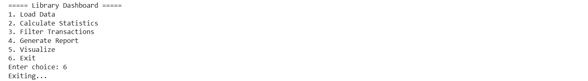

# Project Documentation

## Table of Contents
- [Project Overview](#project-overview)
- [Project Structure](#project-structure)
- [User Interface](#user-interface)
- [File Descriptions](#file-descriptions)
- [Getting Started](#getting-started)
- [Current Status](#current-status)

---

## Project Overview

This project is a library management system with a user interface component. The project is designed to provide essential functionality for managing library operations and resources through an intuitive interface.

**Project Location:** `c:\Users\dhruv\OneDrive\Desktop\final`

---

## Project Structure

```
final/
├── library.py          # Main Python module (currently empty - ready for implementation)
├── UI.png              # User Interface design/screenshot
└── README.md           # This documentation file
```

---

## User Interface

The project includes a visual interface design as shown below:

### UI Screenshot



*Figure 1: Project User Interface Design*

This UI provides the visual representation of the application's look and feel. It serves as the blueprint for implementing the front-end components and user interaction flows.

---

## File Descriptions

### 📄 library.py

| Attribute | Details |
|-----------|---------|
| **Status** | Empty (Ready for Implementation) |
| **Purpose** | Main Python module for library management logic |
| **Language** | Python |
| **Size** | 0 bytes |
| **Type** | Core Logic Module |

**Description:**
This is the main Python file where the core library management functionality will be implemented. It will contain:
- Core classes and functions
- Data management logic
- Business logic implementation
- Library operations

### 🖼️ UI.png

| Attribute | Details |
|-----------|---------|
| **Type** | PNG Image |
| **Purpose** | User Interface Design/Mockup |
| **Format** | Raster Image (PNG) |
| **Usage** | Visual reference for UI implementation |

**Description:**
This is the visual design file that depicts the user interface layout, components, and design elements of the application.

---

## Implementation Guidelines

### For library.py Development

Based on the UI design, the following components/features should be implemented:

1. **Data Structure**
   - Design appropriate classes for library data models
   - Define data structures based on UI requirements

2. **Core Functionality**
   - Implement business logic as per UI flow
   - Create functions for main operations
   - Handle data validation and error management

3. **Integration**
   - Ensure compatibility with the UI design
   - Implement necessary interfaces for user interaction

### Code Standards
- Follow PEP 8 guidelines for Python code
- Include proper documentation and docstrings
- Add error handling and validation
- Use meaningful variable and function names

---

## Getting Started

### Prerequisites
- Python 3.7+
- Required libraries (to be defined as implementation progresses)

### Installation

1. Navigate to the project directory:
   ```bash
   cd c:\Users\dhruv\OneDrive\Desktop\final
   ```

2. Install any required dependencies:
   ```bash
   pip install -r requirements.txt
   ```
   *(Note: requirements.txt file to be created as dependencies are identified)*

### Running the Project

Once implementation is complete:
```bash
python library.py
```

---

## Current Status

### ✅ Completed
- [x] Project structure setup
- [x] UI design created (UI.png)
- [x] Documentation template created

### 🔄 In Progress
- [ ] Core library management logic implementation
- [ ] Data models and class definitions
- [ ] Main functionality features

### ⏳ Pending
- [ ] Testing and validation
- [ ] Error handling implementation
- [ ] User interface development
- [ ] Integration and deployment

---

## Development Roadmap

| Phase | Task | Status |
|-------|------|--------|
| 1 | Project setup | ✅ Complete |
| 2 | Design UI mockup | ✅ Complete |
| 3 | Implement core logic | ⏳ Pending |
| 4 | Add features | ⏳ Pending |
| 5 | Testing | ⏳ Pending |
| 6 | Deployment | ⏳ Pending |

---

## Features (Planned)

Based on the UI design, the following features are planned:

- Library catalog management
- Book search and filtering
- User management
- Borrowing and returning system
- Fine calculation for overdue books
- Reservation system
- Report generation

---

## Technologies & Tools

| Category | Technology |
|----------|-----------|
| **Language** | Python 3.x |
| **Framework** | To be determined |
| **Database** | To be determined |
| **Testing** | To be determined |
| **Deployment** | To be determined |

---

## Notes & Observations

- The `library.py` file is currently empty and ready for implementation
- The UI design provides a clear visual specification for the application
- Documentation should be updated as features are implemented
- All code should follow Python best practices and conventions

---

## Support & Questions

For questions or clarifications about this project structure and implementation plan, please refer to the UI design (UI.png) and update this documentation as the project evolves.

---

## Version History

| Version | Date | Changes |
|---------|------|---------|
| 1.0 | 2026-03-26 | Initial project documentation |

---

**Last Updated:** March 26, 2026

**Project Author:** [dhruv prajapti]

**License:** [To be specified]

---

*This is a template documentation. Please update sections as the project develops and implementation progresses.*
